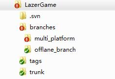

修改历史： 
2017/08/05 18:21  更新SVN、项目、Unity规则等。

Reference：
https://wiki.unrealengine.com/Assets_Naming_Convention
https://docs.unrealengine.com/latest/CHN/Engine/Basics/SourceControl/SVN/index.html

##前言
本文主要关于资源的命名形式和文件夹结构。 根据Unreal工程项目命名规范为基础，并扩展到Unity项目中。

## 一、SVN结构

### 1. 项目目前都使用SVN作为默认的项目管理工具。使用默认SVN结构，根目录下分为branches、 tags、 trunk三个文件夹。如图：

* trunk：是用来做主方向开发的，一个新模块的开发，这个时候就放在trunk，当模块开发完成后，需要修改，就用branch。 
* branch：是用来做并行开发的，这里的并行是指和trunk进行比较。
* tag：是用来做一个milestone的，不管是不是发布版本，但都是一个可用的版本。这里，应该是只读的。更多的是一个显示用的，给人一个可读的标记。

### 2. trunk下目录，分为Project（根据项目、引擎、开发阶段等自行命名）、Resource、Design、Publish等文件夹。

* Document： 设计文档文件夹。包括设计文档、 概念原画等设计文档文件。也可以包括技术或者美术方向的论文或技术资料等。一般不会在引擎或者项目中使用。可以外链单独SVN。
* Resource： 资源文件夹。 放置原版、未导入版本的模型、贴图、动画、UI等美术资源。也可以放置游戏数据表格或者其他游戏独立数据文件。还可以用来保存或者链接独立插件或者第三方插件。文件夹下的所有资源必须是直接用于或者间接用于项目或引擎的资源。可以外链单独SVN。
* Project： 一般是指Unreal或者Unity的项目目录，或者是其根目录、它包含了一个或者多个项目。一般只将这个文件夹进行branch/tag..
* Publish： 根据版本号、平台等用来维护发布产品的文件夹。可以外链单独SVN。

## 二. Project文件夹项目结构
### 1. Unity项目基本结构为

Asset、ProjectSettings需要同步到SVN。Library、obj、.vs、Build文件夹SVN忽略。
Asset下设置Source文件夹（源代码文件夹）、Content文件夹（引擎内部资源文件夹）、Plugins文件夹（插件文件夹）用来。目的是和Unreal项目机构保持一致。
### 2. Unreal项目：

被高亮为 绿色 的目录和文件应该被添加到项目的 SVN中。Binaries 目录高亮为 黄色，可以选择是否要加入到版本管理中，这取决于团队自生的工作需要。 如果团队中每个人都准备自己来编译引擎和游戏的话，那么 Binaries 则无需加入到版本管理中，但如果团队中有人只是想获取一个版本就能直接在编辑器中工作的话，则需要把 Binaries 添加上去。其他文件夹SVN忽略。
如果项目使用了插件。Plugins文件夹也要同步到SVN。Plugins内部项目SVN规则和普通项目一致。如图：

## 三. Content文件夹结构和其中文件的命名规则
### 1. 所有命名必须以英文命名，所有英文采用单数形式命名。
### 2. 一个引擎内部资源所依赖的所有导入引擎的资源文件必须在同一文件夹下（除非是公共资源），不要将非导入引擎的资源直接放置在项目文件中防止引擎自动导入出现问题。
例如： FPSoldier文件夹中存放第一人称士兵游戏角色资源，所有导入引擎的贴图，模型，材质，动画，声音等需要存放在FPPawn下
文件夹结构如下：
Content
|----Character
|----Player
|----FPSoldier		  资源命名
|----Blueprint		蓝图文件夹
|----Mesh			模型文件夹
|----Material		材质文件夹
|----Texture		贴图文件夹
|----Animation		动画文件夹
|----Particle		粒子文件夹
|----LensFlare		镜头光晕文件夹
|----Sound		声音文件夹
|----Morph		形变动画文件夹
|----FaceFX		面部动态效果文件夹
|----Sheet			表格数据文件夹

3. Content资源基础文件夹结构：

Content						内容根文件夹
|----Map						关卡地图文件夹
|----Episode（_Number）	 章节地图文件夹   （_Number）用01,02,03等代替
|----TestMap				 测试地图文件夹
|----Base						公共材质，公共材质方法和其他公共资源文件夹
|----Character					角色文件夹
|----NPC					 NPC文件夹
|----Player				 玩家控制角色文件夹
|----Effect						特效文件夹
|----Environment				环境文件夹
|----Background			 背景环境文件夹
|----Building				 建筑文件夹
|----Foliage				 植被文件夹
|----Prop					 道具文件夹
|----Sky					 天空文件夹
|----Landscape				 地形文件夹
|----Water				 水面文件夹
|----Gameplay					各种服务于玩法的资源文件的文件夹
|----PostProcess				后期及镜头特效文件夹
|----Sound					公共声音文件夹
|----UI						公共UI文件夹
|----Vehicle					车辆及交通工具文件夹
|----Weapon					武器及子弹文件夹

4. 分类文件夹
在基础文件夹下面，以资源的名字命名资源文件夹，在资源文件夹下以资源种类分文件夹如
Content		
|----Environment				
|----Background                 基础文件夹
|----Moutain				包含远景山地资源的文件夹
|----Blueprint
|----Mesh
|----Material				资源文件夹下的各个资源分类文件夹
|----Texture
|----Animation

5. 资源分类文件夹一般有但不是必须全部都有，有一下几个种类：
Blueprint 蓝图文件夹
Mesh 模型文件夹
Material 材质文件夹
Texture 图片文件夹
Animation 动画文件夹
Particle 粒子文件夹
LensFlare 镜头光晕文件夹
Sound 音效文件夹
Morph 形变动画文件夹
FaceFX FaceFX文件夹
Sheet 表格数据文件夹

6.资源命名
资源命名的形式一般为
（前缀_）资源名（_序号）（_后缀）
其中前缀至少有一个。后缀可以没有或者有一个或多个。
例如： T_Rock_01_D、SK_Robot

根据文件类型定义的前缀（优先级最高）
ABP_ Animation Blueprint 动画蓝图节点
AS_ Animation Sequnces 动画序列
AM_ Animation Montage 动画蒙太奇
AC_ Aniamtion Composite
BS_ Blend Spcae
BS1D_ Blend Spcae1D
BP_ Blueprint 蓝图类型文件
SK_ Skeletal Mesh 骨骼模型
SM_ Static Mesh 静态模型
AD_ Apex Destructible Asset
AC_ Apex Cloth Asset
MT_ Morph Target 行变动画
ST_ SpeedTree
PS_ Particle System 粒子系统
LF_ LensFlare 镜头光晕
VF_ Vector Feild
S_ Sound 音效
SC_ Sound Cue 音效效果器
M_ Material 材质
MI_ Material Instance 材质实例
MITV_ Material Instance Time Varying
MF_ Material Function
MPC_ Material Parameter Collection
T_ Texture 贴图
SP_ Sprite 精灵
SS_ Sprite Sheet
TC_ Texture Cube
RT_ RenderTarget
PM_ Physical Material 物理材质

根据文件用途的前缀（在文件类型的前缀之后）
CH_ Character 角色
UI_ User Interface
VH_ Vehicle 车辆交通工具
WP_ Weapon 武器
PJ_ Projectile 投射子弹

后缀

图片用的后缀
_BC BaseColor
_MT Metallic
_S Specular
_R Roughness
_N Normal
_DP Displacement
_AO Ambient Occlusion
_H Height Map
_FM Flow Map
_L Light Map(fake)
_M Mask
模型用的后缀
_Physics physics asset
_FaceFX FaceFx Asset

7. 贴图Mask各个通道的用途

角色身上的RGB贴图
R - Metallic
G - Roughness
B - Subsurface Opacity

角色头发上的RGB用途
R- Hair Alpha
G - Specular\Roughness
B - Anisotropic direction

环境物体上的RGB用途
R - Metallic
G - Roughness
B - Ambient Occlusion

四、Source源代码文件夹下的结构
Unity和Unreal下的Source文件夹尽量保持一致，如下

