# 综合PBR指南 / 基于物理着色和渲染的理论 （For Artist）

Source ： https://www.allegorithmic.com/system/files/software/download/build/PBR_Guide_Vol.1.pdf

## 第一部分 光与物质 Light and Matter
光是一种具有波粒二象性的复杂物理现象。人们创造出多种物理模型来描述光的物理行为。作为材质美术，我们更感兴趣的是光线模型（Light Ray Model），它描述了光和物质的作用原理。因为我们的工作是创建描述物质表面的贴图，所以理解光和物质表面的相互作用尤为重要。我们控制虚拟世界中的材质和贴图，当我们对光的行为愈加理解，我们越能创造出好看的贴图。
在这篇说明中，我们将会讨论PBR（基于物理的渲染）模型背后的物理原理。我们将会从光线讲起，一步步探索PBR模型中的关键因素。

### 光线 （Light Rays）
光线模型主要描述：光在均匀介质中（如空气）沿直线传播，而当光线接触不透明表面或者穿过其他均匀介质（如玻璃、水等）时会发生可以预测的改变。这使得我们能够追踪光的传播途径和光的能量转化形式。
接触接触面之前的光线称为入射光，入射光与接触面法线的夹角称为入射角。接触面指的是两种不同介质相接触的平面。
光接触接触面之后会发生下面一种或两种现象。
1. 反射 —— 遵从反射定律，反射角等于入射角。
2. 折射 （TODO，折射公式）。

所以，当光遇到表面的时候我们能很简单的将光分为两部分：反射的部分和折射的部分。光可能在介质中传播时被吸收，但是在这种两种均匀介质的接触面，并不会有光被吸收。

入射光（Incident Ray/Light)，入射角(Angle of Incidence), 反射光（Reflected Light），反射角（Angle of Reflection），折射光（Refracted Light）

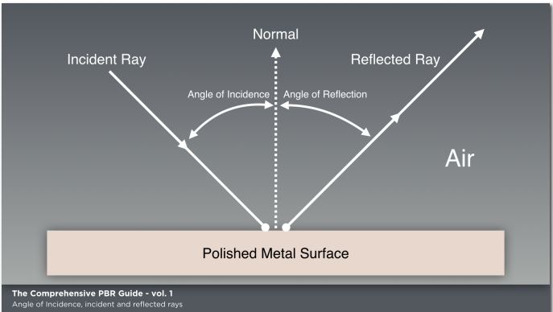
### 吸收和散射（透明和半透明） Absorpiton and Scattering（Transparency and Translucency）
* 在非均匀介质或者（半）透明材质中，光可能被吸收或闪射。
* 发生吸收时，光强减弱，光的颜色随波长变化，然而方向没有改变。（被吸收的光，主要转化为热。）
* 发生散射时，光的方向随机变化，偏移量根据材质不同而不同。散射更改光的方向但是不更改光的强度。
* Thickness Map可以用来描述光被吸收和散射的程度。（TODO： Thickness Map原理）
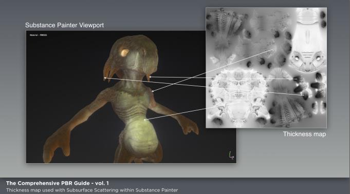
### 漫反射和镜面反射（Diffuse and Specular）
* 镜面反射就是光线在理想Light Ray模型表面发生的反射。这时的表面绝对光滑，遵守反射定律。
* 漫反射的表面是不规则的，随机的。反射光方向和表面粗糙程度(Roughness)具有相关性。
* 无论是镜面反射还是漫反射，光强在反射时都是守恒的。
* 越是粗糙的表面，高光光斑越大越模糊不清。
* 光滑的表面在反射角度上可以看得更加亮。
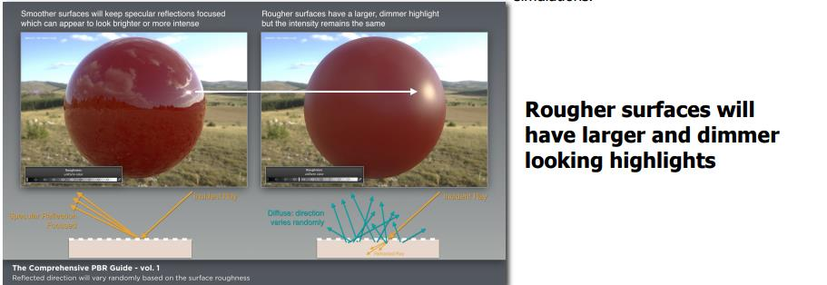
* 漫反射还有一种情况是光线发生了折射，一部分光线从一个介质传输到另一个介质中，并在物体内部进行了多次散射，然后这些光线又再次在入射点的附近折射出表面。如下图所示：
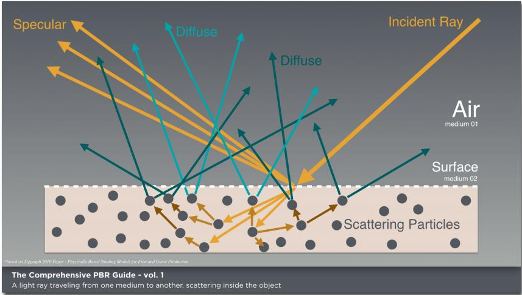
* 漫反射材质是可吸收光照的，意味着光线在材质中传播的距离过长就会完全被吸收。所以也意味着漫反射光反射点不会距离入射点太远。可以在数学上近似为一个点。
* Lambert光照模型（TODO：光照模型的历史）中，把diffuse当做场景反射的基本形式，并没有将表面roughness考虑进来，但是也有考虑了roughness的光照模型OrenNayar模型。
* 半透明材质和PM（颗粒介质）是指那些具有高散射低吸收（光强衰减）的材质，例如烟雾，牛奶，翡翠，大理石等。渲染这些材质的时候最好加入次表面散射模型（subsurface scattering模型，TODO），因为他们的入射点和出射点不能再近似的看成一个点了。事实上想渲染这些材质需要消耗更多的方法，如Monte Carlo。
### 微面原理（Microfacet Theory）
* 根据微面原理解释的话，漫反射和镜面反射都是由接触面的不规则决定的。
* 事实上，漫反射受粗糙度的影响并不是很明显，因为造成漫反射的散射其实是发生在材质的内部的。一些物理模型认为漫发射和表面的粗糙度关系不大，例如在Lambert模型中就认为两者完全没有关系。
* 这篇文章中所提到的粗糙度（Roughness）概念代表的是接触面的不规则程度。PBR模型中经常提到这几个概念roughness，smoothness，glossiness， microsurface，但是他们其实是在谈论一个相同的概念——亚纹理单元几何细节（sub-texel geometric detail）。
* 接触面的不规则程度一般使用工作流中的roughness或者glossiness贴图决定。PBR模型中的BRDF（双向反射分布函数）是基于微面原理，它认为一个表面是由许多小的完美平面组成的（这些小的完美平面被称之为微面元 microfacet）。微面元上发生的发射现象如下图:

  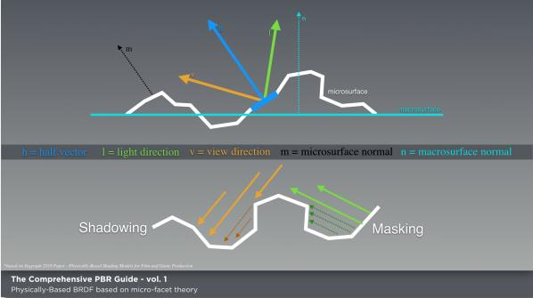
* 那些法线方向 等于 光线和视线的中线方向 的微面元才会贡献可见的反射光。但是并不是所有这些微面元都会贡献光，因为有一部分的入射光线会被遮挡，还有一部分的反射光会被遮挡。
* Substance PBR模型是基于GGX微表面分布的（GGX Microfacet distribution TODO）。
* 表面不规则在显微程度上会引起光的漫反射。例如，模糊的光斑就是光线在微面上反射后，反射光不平行的而引起的。如下图：

  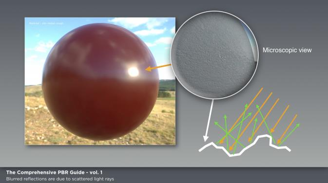
### 颜色（color）
* 物体所表现出来的材质颜色是由 光源发射出的特定波长的颜色光 经过表面吸收，漫反射和镜面反射后，进入摄像机的光的波长 决定的。例如下图中的苹果，它几乎只反射红光，也只有红色的光经过内部散射再出来，其他颜色的光几乎被吸收。
* 苹果表面能够反射出和光源颜色一样的高光。这是因为苹果是电的不良导体，镜面反射几乎与入射光波长无关。
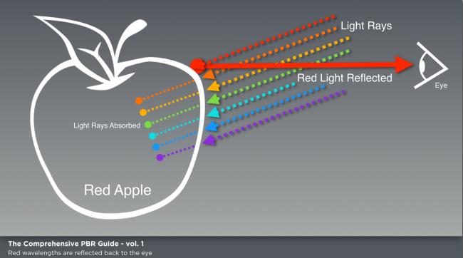
### BRDF（双向反射分布函数） 
* 简单来说就是，描述表面反射属性的方法。
* 计算机图形学中，有许多BRDF方法，其中有一些是不遵守物理学的。而符合物理的BRDF，最基础的就是能量衰减和形式可逆。形式可逆的概念可以用Helmholtz Reciprocity准则来解释，它定义I_out = BRDF(I_in) && I_in = BRDF(I_out)。（？？？不理解 wiki : https://en.wikipedia.org/wiki/Helmholtz_reciprocity ）
* Substance用的是Disney的反射比准则，是基于GGX microfacet distribution。GGX提供了一个依据镜面反射分布（specular distribution描述了一个短小的高光光斑和一个长的衰减拖尾）的更好方法，如下图。
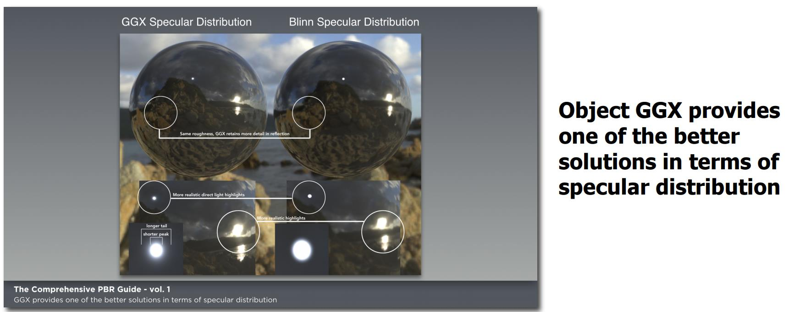
### 能量衰减（Energy Conservation）
* 能量减少的定义是经过接触面射出的光（包括反射和散射出的光）总量少于接触面接受的光。换句话说，从接触面反射出的光少于入射的光。贴图美术一般不考虑能量衰减，这部分一般由着色器完成，这样使得我们更专注于美术而不是物理。
### 菲尼尔现象(Fresnel Effect)
* 菲涅尔反射参数在PBR的BRDF中也是一个重要参数。菲涅尔现象描述的是观察角度和接触面的光反射的关系。
* 我们以一滩水为例。假如你从水的正上方去看，能够看见水底。而你在几乎平行水面的角度去看就只能看见水面的镜面反射。
* 不同于其他光照模型，在PBR模型中，菲尼尔现象不需要贴图美术来控制。对于在掠入角观察来说，所有光滑表面将会称为一个对于90度入射光的镜面。
* 对于粗糙表面，反射将会极大的变为镜面反射，但是不会达到100%镜面反射。这时起到关键作用的是微表面的法线，而不是宏观表面的法线。这时的光线更加柔和一些，有些像是所有微表面的菲涅尔平均值。
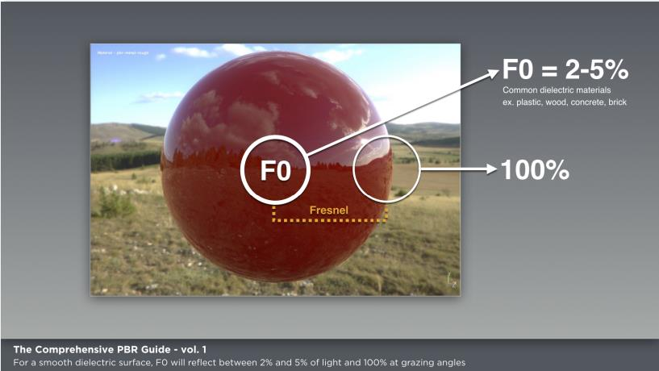
### F0(在角度为0时的菲涅尔反射)
* 当入射光垂直接触面（即入射角为0）时，镜面反射光占的百分比被称为F0。使用接触面折射率比能够计算出F0。而被折射的部分比例为1-F0。（TODO，折射公式）公式如下图。
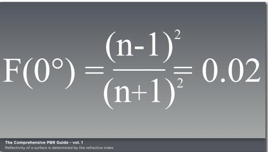
* 大部分一般电解质的F0在0.02到0.05之间，导体的电解质在0.5到1.0之间。下图时一些由折射率决定材质的反射比。
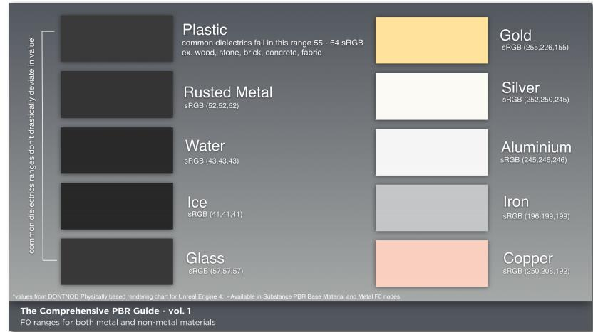
* 对于我们在制作贴图时关心的F0反射比，非金属材质是一个灰度值，而金属材质是一个RGB值。对于一个光滑电解质平面，F0时会反射2%到5%，掠入角将会是100%。
非金属的反射率变化通常不会这么剧烈的变化。
### 导体和绝缘体（金属和非金属，Metal and Non-Metal）
* 对于导体来说，导体会将折射的光线全部吸收。擦亮的金属的反射比在70-100%之间。不同金属吸收的光波长不一样。例如，金子吸收光谱末端的高频蓝光，而显示出黄色。因为折射的光线都被吸收了，来自我们贴图中的反射光就成了金属的着色。金属没有漫反射颜色。例如，在之前的Specular/gloss工作流中，纯金属的漫反射（Diffuse）贴图使用黑色，而镜面反射（Specular）贴图使用一个颜色值来代表反射率。对于金属来说，反射率的值是一个RGB着色值。而对于PBR模型来说，我们需要一个真实世界的参考值来在我们的贴图上反应金属反射率。
* 关于金属另一个重要的事实是金属会被侵蚀。这意味着表面侵蚀在金属反射上也起到了很重要的作用。例如生锈的金属中的锈渍就是属于非金属。而发生侵蚀的金属则处于金属和非金属之间。如下图：
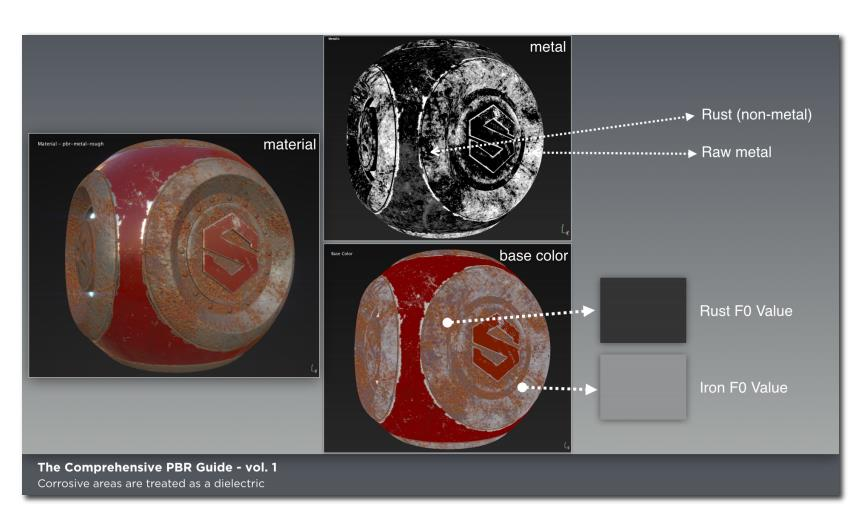
* 非金属的折射光被吸收和散射（散射的部分经常会再次从表面射出），它们反射的光比金属少而且会有一个Albedo颜色。根据计算绝缘体的F0在2-5%之间。我们很难像金属一样找到一个能够形容绝缘体反射比的值，不过，既然大部分绝缘体的反射比很接近，我们可以利用在第二卷的方法来估计。
### 线性空间 Linear Space
### 名词解释
### 引用

## 第二章 创建PBR纹理的实用指南
这部分是从贴图艺术加的角度重新看PBR流程。本章节主要内容为：确定设计Metalic/Roughness工作流的基本原则，讨论Specular/Glossiness工作流。如图是两种工作流的概述。

1. 什么是PBR？
PBR的优势：（1）PBR消除了创作材质的猜测过程。（2）在各种光源下都足够逼真。（3）PBR工作流具有一致性。方便不同的美术工作者一起工作。
2. 金属/粗糙度工作流（Metal-Roughness Workflow）
主要贴图由BaseColor（sRGB）、Metallic（GrayScale）、Roughness（GrayScale）组成。如下图.
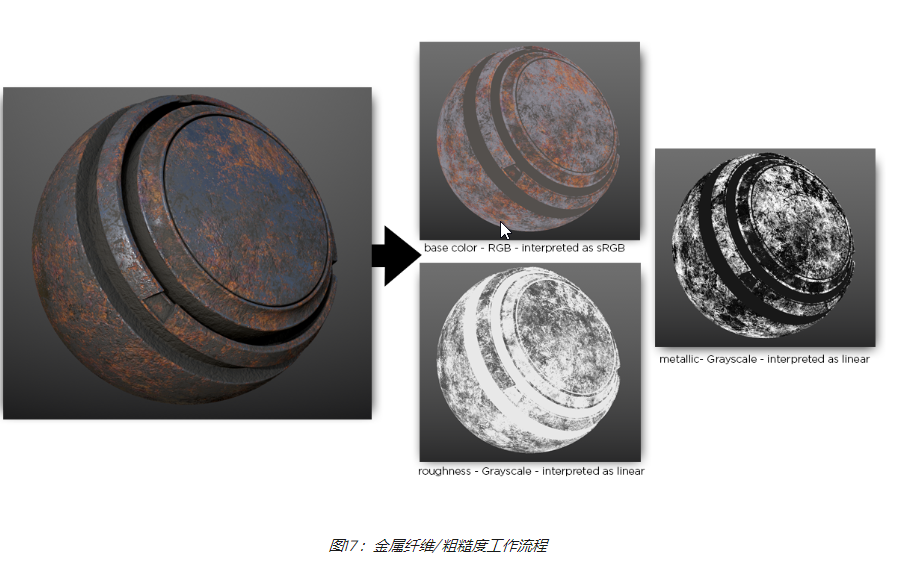
当然两种工作流都可附加Height、AO等贴图来增强效果。如下图：
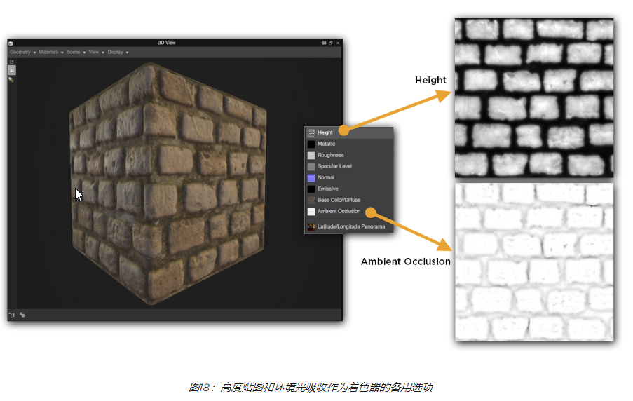
在Metal-Roughness工作流中，BaseColor贴图放映的金属反射率，同时也代表绝缘体的反射颜色。Metallic贴图用来区别金属和非金属。绝缘体的F0并不是手动创建的，而是由PBS控制的。Metallic贴图的黑色部分会被当作绝缘体处理，反射率为4%。如下图：
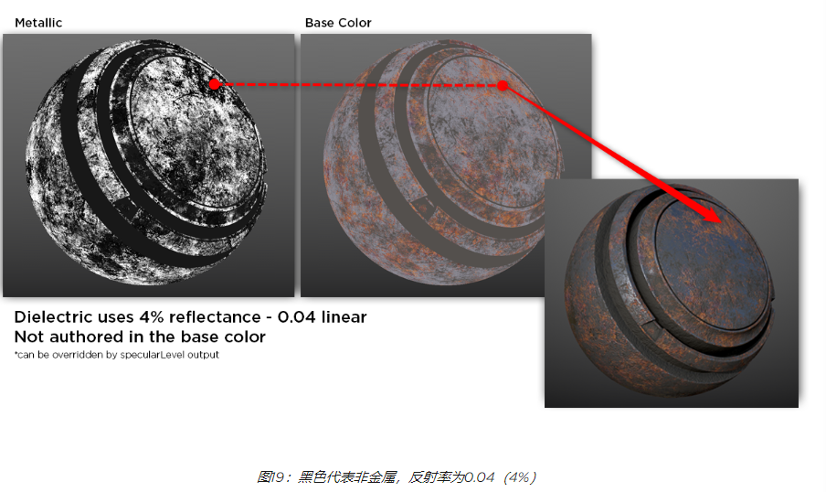
在上一章我们谈到大多数绝缘体的反射率为4%，这个值在PBS中为硬编码值。金属反射率的值位于BaseColor贴图上，同时这张贴图还便是绝缘体的反射光颜色。Subtance和UE4中的一些Metal-Roughness组件有Specular来控制绝缘体的镜面反射控制，可以供美术人员更改绝缘体的F0。Specular的输出范围是由Metallic决定的取值范围从0%到8%，然后输入范围被映射为0-1。举例来说当Metallic=0的绝缘体，Specular=0.5的F0为4%。映射关系如下图：
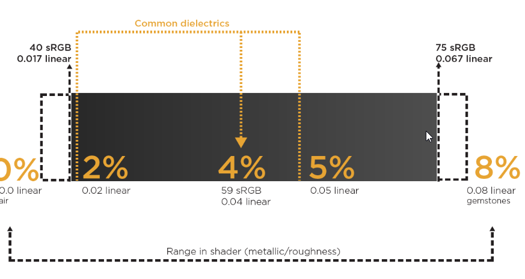
### BaseColor贴图的制作
代表两种数据类型：绝缘体的漫反射颜射和金属的反射率值。换句话说，绝缘体时BaseColor代表漫反射的颜色，纯金属时为金属的反射率F0。
绝缘体BaseColor贴图相对于DiffuseColor一般对比度比较低。不建议使用过亮或过暗的数值。对于暗色的竖直不能低于30-50sRGB，对于亮部不能高过240sRGB。如下图：
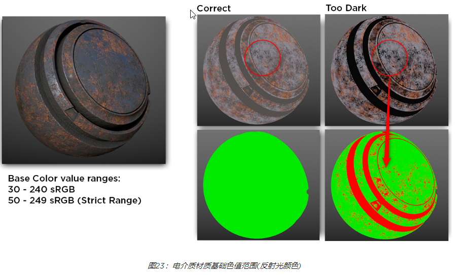
BaseColor一般包括绝缘体的Diffuse数据，没有光遮蔽信息。如果在BaseColor中增加了Micro-Occlusion，亮度范围在180到255sRGB。
金属的BaseColor代表导体的反射率，一般在真是世界中测量获得。
