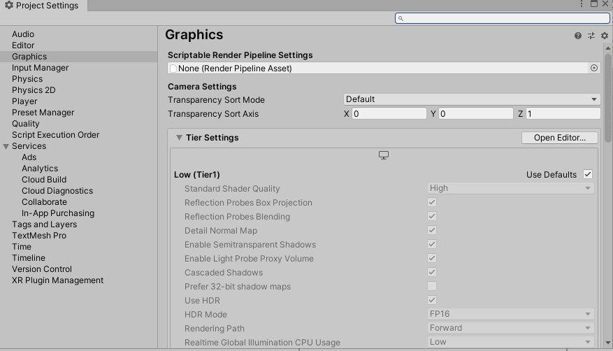

#  Unity Scriptabale Render Pipleline

SRP是Unity为用户提供对Unity渲染管线全部控制的工具包，通过此工具包能够创建现代、高效的图形渲染。

SRP允许通过C#控制每帧的渲染，打开渲染管线的黑盒。Unity提供了内置的渲染管线：
* URP，通用渲染管线，为从移动端到次世代主机和PC提供图形渲染的通用管线。
* HDRP，提供基于物理的光照技术，为高性能、现代架构、Compute Shader可用的平台设计。

## 1. SRP Core
SRP Core是提供渲染内部功能和配置的API，通过使用它能够定制化渲染。
  
SRP Core API提供一下接口：
* 灯光
* 材质
* 相机
* Command Buffer

## 2. SRP解决的问题
传统的U你体验提供一些内建好的渲染管线，前向渲染和延迟渲染。前向渲染更加适合移动端和VR，延迟渲染更适合更高级的视觉效果。但是这些渲染管线是黑盒，这带来了如下问题：
* 他们只能按照自己设计的方式工。（无法拓展）	
* 他们是一般性解决办法，他们需要解决所有问题，而不是专注某些。（无法特制化）* 	他们不可配置。这些黑盒规定好了用户插入渲染命令的切入点无法改变。（无法特制化）
*	扩展和修改容易出错，因为较小的内部更改可能会产生较大的外部影响。（无法拓展）
*	Unity也不能修正许多bug，因为修改这些表现，会让项目崩溃。（无法拓展）
所以SRP Core为了解决上述问题，能够把内建的黑盒渲染管线改变成一个可以控制、可以特制化、针对项目、可编程的渲染管线。
## 3. SRP Asset
SRP Asset 是对Unity渲染管线的定制化配置。它储存的信息包括：
* GameObject是否能投射阴影
* 使用何种Shader质量等级
* 阴影距离
* 默认材质配置
* 任何你希望通过SRP Asset使用和配置的变量	
SRP Asset包含定制化渲染管线的接口。引擎在开始调用渲染器的时候，会调用InternalCreatePipeline方法来创建可用的渲染实例。SRP Asset自身是一个ScriptableObject，它能够保存在项目中并且通过版本控制工具来正确的使用。通过在项目图像设置中，设置SRP Asset来使用它。
	

	
SRP Asset中还可以包括一些帮助方法像是：
* 3d GameObject的默认材质
* 2d GameObject的默认材质
* 粒子系统的默认材质
* 地形使用的默认材质
	
当引擎使用的SRP Asset发生了变化，引擎会摧毁当前的渲染实例然后在下一帧创建新的实例。下面的例子包含一个SRP Instance清空屏幕使用的颜色，它也为编辑器提供创建SRP Asset的帮助。

```C#
[ExecuteInEditMode]
public class BasicAssetPipe : RenderPipelineAsset
{
    public Color clearColor = Color.green;
	#if UNITY_EDITOR
    // Call to create a simple pipeline
    [UnityEditor.MenuItem("SRP-Demo/01 - Create Basic Asset Pipeline")]
    static void CreateBasicAssetPipeline()
    {
        var instance = ScriptableObject.CreateInstance<BasicAssetPipe>();
        UnityEditor.AssetDatabase.CreateAsset(instance, "Assets/BasicAssetPipe.asset");
    }
#endif
	  // Function to return an instance of this pipeline
    protected override IRenderPipeline InternalCreatePipeline()
    {
        return new BasicPipeInstance(clearColor);
    }
}
```

	
## 4. SRP Instance
SRP Instance是实际控制渲染的类。使用SRP时，当前SRP Asset必须提供一个SRP Instance来渲染。SRP Instance中包含Render方法。Instance代表了渲染管线，工作过程如下：
* 清空当前Framebuffer
* 执行场景剔除
* 渲染GameObjects集合
* 执行Blits到Framebuffer
* 渲染阴影
* 添加后处理效果

SRP Asset控制配置，而SRP Instance则是控制渲染的入口。自定义渲染管线时，SRP Instance就是渲染逻辑在的地方。
	
最简单的SRP Instance也需要包含一个基本的渲染方法，Render方法。这个方法可以认为是为一个可以自由填充的空白的画布。Render方法有两个传参：
* ScriptableRenderContext， 你使用的可以将你的渲染操作入队的CommandBuffer类型。
* 渲染用的Camera集合。

下面是一个简单的例子：
```C#
public class BasicPipeInstance : RenderPipeline
{
    private Color m_ClearColor = Color.black;
	  
    public BasicPipeInstance(Color clearColor)
    {
        m_ClearColor = clearColor;
    }
	  
    public override void Render(ScriptableRenderContext context, Camera[] cameras)
    {
        // does not so much yet :()
        base.Render(context, cameras);
	      // clear buffers to the configured color
        var cmd = new CommandBuffer();
        cmd.ClearRenderTarget(true, true, m_ClearColor);
        context.ExecuteCommandBuffer(cmd);
        cmd.Release();
        context.Submit();
    }
}
```

上面的例子是简单的使用指定颜色清理屏幕。SRP Instance创建时需要注意一下几点：
* SRP使用引擎内建的CommandBuffer类来完成许多操作，例如例子中的ClearRenderTarget
* SRP使用传入的Context来处理CommandBuffer。
* SRP渲染的最后一部叫做Submit。它将Context的队列命令结果输出。

RenderPipeline.Render方法是自定义渲染的和兴方法。在这个方法里处理剔除、过滤、更换ReanderTarget，绘制等。
	
 ## 5. SRP Context
	
 SRP渲染使用延迟处理的概念。用户创建一系列命令然后执行它们。SriptableRenderContext用来组织这些命令，然后最为传参在Render方法中工作。
	
 当完成工作时，通过Submit方法，将所有的渲染命令提交。
 
## 6. 在SRP中进行剔除（Culling）

剔除是指找出屏幕都需要渲染什么的过程。

在Unity中，剔除包括：
* 视锥体剔除，Frustum Culling，检查GameObject是否在摄像机的视野、远近裁面内。
* 遮挡剔除，Occlusion Culling，检查GameObject是否被完全遮挡。

当引擎开始渲染时，第一件事就是进行计算应该渲染什么。这个过程使用摄像机来执行摄像机裁剪过程。剔除操作能够返回一系列摄像机应该渲染的物体和灯光。这些将在之后进行绘制。

在SRP中，你一般通过摄像机来完成剔除过程，这和引擎内置的过程是一致的。剔除的例子如下：

```C#
	      foreach (var camera in cameras)
	      {
	          ScriptableCullingParameters cullingParameters;
	
	          if (!camera.TryGetCullingParameters(out cullingParameters))
	              continue;
	
	          context.Cull(ref cullingParameters);
	      }
```

## 7. 在SRP中进行绘制（Drawing）
在开始绘制场景之前，需要了解以下方面以方便做决定：
* 渲染管线的目标硬件
* 你期望达到的外观和感觉
* 当前项目的类型
	
比如说，一个2D移动端滚轴游戏和一个3D次世代PC第一人称游戏限制是不同的，实现渲染管线也有很大的不同。一些必要考虑的内容包括：
* HDR 或者 LDR
* 线性空间 或者 Gamma空间
* MSAA 或者 后处理AA
* PBR 或者 简单材质
* 光照 或者  无光照
* 光照技术
* 阴影技术
	
###	过滤（Filtering），渲染群组和层
	
一般来说，GameObject包括某些特殊的种类，例如不透明、半透明、此表面等等。Unity使用渲染队列的概念来代表渲染的GameObject。这些队列定义了渲染的群组。当SRP渲染场景时，我们指定那些组来渲染。除了组外，我们还是用Unity Layer来过滤。

以下代码时过滤的例子：

```C#
        FilteringSettings opaqueRange = new FilteringSettings();
	      opaqueRange.renderQueueRange = new RenderQueueRange(0, (int)RenderQueue.GeometryLast);
	      opaqueRange.layerMask = ~0;//Every thing
```

### 绘制设置：如何绘制
	
使用剔除和过滤决定哪些SPR渲染，然而用户也需要决定如何去渲染他们。SPR提供了多种渲染选项，使用DrawRenderSetting是能够决定以下渲染设置：
* 排序，渲染GameObject的顺序，例如从前到后或者从后道前
* Per-Render Flag，引擎传递给Shader的设置，包括诸如光照探针、光照贴图。
* Render Flag， SPR使用何种算法进行批次合并，诸如instancing或者non-instancing
* Shader Pass， 哪个Shader Pass当前渲染应该使用。
	
例子如下：
```C#
    ShaderTagId shaderTag = new ShaderTagId("Opaque");
    SortingSettings sorting = new SortingSettings(camera);
	
    DrawingSettings drawingSettings = new DrawingSettings(shaderTag, sorting);
    drawingSettings.enableInstancing = true;
 ```
	
	
	
