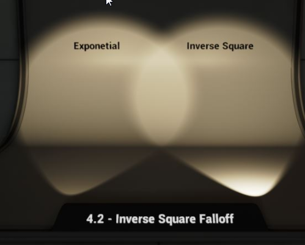
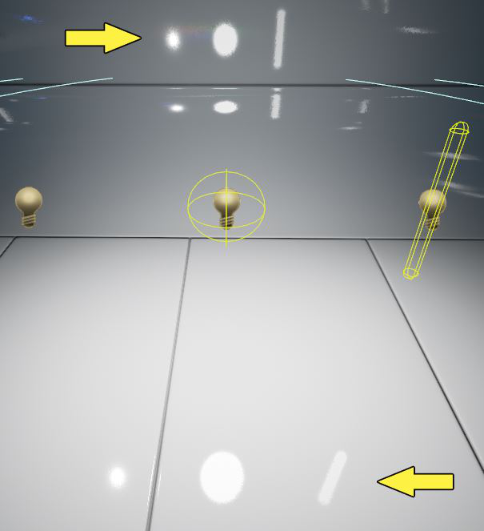
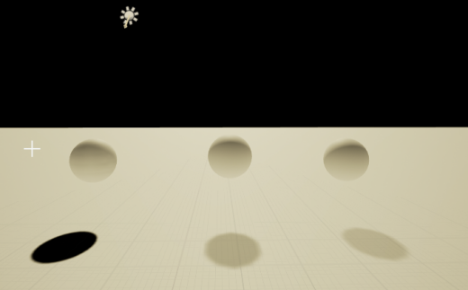
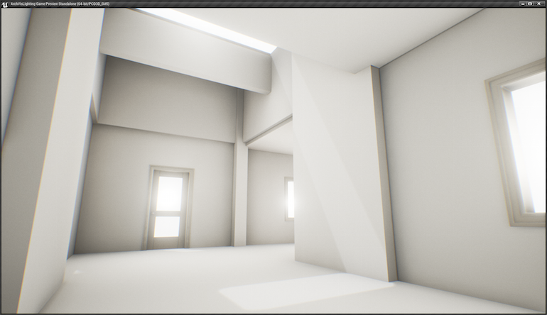

# Unreal 灯光笔记 （For Lighting Artist）
笔记第一版来自 UE4.12，部分内容来自版本 UE4.18

## 第一部分 灯光基础
### 1. 放置光源 (Placing Lights) 
略
### 2. 亮度 (Intensity) 
亮度代表光源的输出能量。

对于 点光源 和 聚光灯源, 在使用 反平方衰减(Inverse Squared Falloff), 亮度是使用的单位是 流明(lumen, 一种光通量计算单位), 1700lumen和100W的灯泡亮度一致。
对于定向光源, 亮度代表亮度乘子(brightness multiplier)。
最终,光照在物体材质上的亮度受光源的衰减方式\衰减半径\颜色影响,同时如果在后处理中启用了人眼调节(Eye Adaptation),还会受到其他光源的间接影响。
### 3.颜色 (Light Color) 
略
### 4.衰减 (Attenuation)
衰减(Attenuation 或者 Falloff),定义了光从光源向外发射过程中的能量损失率。

衰减半径，提供光照的范围\是计算物体是否受到光照影响的标准\作为光照衰减计算的重要参数.通常来说,一个光源的衰减范围内物体越多,它的消耗就可能越高。
#### (1)反平方衰减
Unreal中点光源和聚光灯源提供了两种衰减方式,一种是反平方衰减,另一种是自定义衰减指数的指数衰减.反平方衰减更加接近真实世界中光的衰减方式.其基本特点是在光源中心的亮度特别大,而在光向外辐射的过程中迅速变暗,至光照半径处衰减为0。

需要注意的是,点光源 和 聚光灯源, 在使用 反平方衰减 时, 亮度是使用的单位是 流明. 对于其他情况, 亮度代表亮度乘子. 流明 和 亮度乘子 在表现光照的时候有很大差异. 例如我们使用 亮度乘子为3的自定义指数衰减显示出的亮光,在更改为反平方衰减后零度只有3lm,这几乎是不可见的.反之,我们将亮度为1700lm的反平方衰减光源更改为指数衰减时,我们会获得一个亮度乘子为1700的氪金狗眼大太阳。

反平方定律在物理学中非常多见,可以代表某种物理量(声光热)的分布或者强度跟距 源 的距离成反平方比.我们假设点光源辐射光的总能量在传播的过程中不会减少,总为P.那么当光传送了r的距离后,会形成一个半径为r的光亮度等值面球.这个球上每个单位面积的亮度(辐射度)为

在Unreal中我们的衰减半径R其实是将真实物理中的r的范围从(0,+∞)夹值到(0,R)。

 

所以,完全模拟自然界点光源需要将衰减半径调的尽量大。

#### (2)衰减指数(Falloff Exponent)
反函数衰减提供了很好的模拟自然界光源的衰减方式,但是在游戏的很多场景中这样的点光源或者聚光灯作用很有限.自定义指数衰减,在不使用反平方衰减的时候,可以自定义衰减的指数。

指数为8的时候比较接近真实光照衰减,而指数为2的时候衰减几乎是线性的.指数越小衰减越慢.当指数很大的时候,光照衰减很快,只能照亮一小部分,但是衰减半径内的物体也都还参与计算,与使用较低的指数的消耗没有区别。

如上图,衰减半径相同,衰减指数大照亮的区域小,但是性能上没有区别。

### 5.光源半径和长度 (Source Radius and Length)
 
 
光源半径和长度描述了光源的形状,这个形状会影响光源的高光光斑形状。

 
 
光源中的Min Roughness选项能够模糊光照中的光斑清晰度.下图为Min Roughness调整为0.3,0.2,0.1之后的光斑效果。

 
 
最后,静态光源的光源半径在烘培光照贴图的时候像区域光一样产生更加柔和的阴影.下图中的红色灯光源半径为0,绿色灯的光源半径为150。

 
 
 ### 6.光照通道
 光照通道（Lighting Channels） 使动态光源(固定光源和可移动光源)仅在其光照通道发生重叠时才对物体产生影响。它主要用于动画，使用户能更自如地掌握 Actor 的照亮。当前虚幻引擎支持最多 3 种光照通道。
定向光源、聚光源、点光源和可被光源影响的所有 Actor（静态网格体、骨架网格体等）均默认启用 Lighting Channel 0。如果需要一个可照亮的 Actor 受另一 光照通道 的影响，必须在 Actor 和光源上同时启用该通道。

 
 
 静态光源的光照通道选项是不可用的,其光照都会烘培到光照贴图中.固定光源在更换光照通道后,间接光还是会进行预计算,并烘培到光照体积贴图(VLM)或者间接光缓存中(ILC)中,而直接光和可移动光源一样遵循光照通道。
 
  
  
如图,其中的三个球体和地面是分配到了光照通道0,而点光源是固定光源且分配到了光照通道1,从图中可以看出三个球体都没有收到不同通道的直接光照影响,但是受到了间接光的影响.另外,使用半透明(translucent)或者遮罩(masked)材质的物体不受光照通道影响。
光照通道的消耗很少,但也不是为0.以下是在Radeon 7870,1080P下的测试结果:

  
  
从虚幻引擎 4.13 开始，光照通道可用于支持以下功能的移动渲染器：
不同通道中支持多个定向光源。
每个图元只受一个定向光源影响，且它将使用设置的首个光照通道的定向光源。
静止或移动定向光源 CSM 阴影只投射在拥有匹配光照通道的图元上。
动态点光源完全支持光照通道。

### 7. 阴影偏差(Shadow Bias) （UE4.24转入移动灯源章节）
 
 ### 8.阴影渗透锐利化(Shadow Filter Sharpen)
 这个属性用来增加阴影边缘的锐利程度.这个值只会影响动态光源(可移动光源和固定光源)产生的动态阴影.这种效果必须离阴影比较近的时候才能看得到.高锐利的灯光让物体看起来更接近光源,不过这种效果并不常用就是了.具体效果如下图:
 
  
  
### 9.自投影精度(Self Shadowing Accuracy)
略
  
## 第二部分 灯光移动性(Light Mobility)
  
### 1. 移动光源 (Movable Lights)
质量最差,只使用动态光照(Dynamic Lighting)和动态阴影(Dynamic Shadowing),不会产生任何静态间接光(Static Indirect Lighting)。

可变性高,可以改变位置\旋转\颜色\衰减\半径和其他属性。

性能消耗高,不进入预计算,只依靠实时计算。
 
#### （1）动态阴影
  直接照亮所有的物体，直接对所有的物体产生全场景动态阴影（Whole Scene Dynamic Shadow），全场景动态阴影具有明显的性能消耗， 这个消耗与受到可移动光照影响的模型数目和模型的三角面数目相关。也就是说一个半径较大的可移动光源造成阴影的性能开销可能会几倍于一个半径较小的可移动光源。
  可移动光源产生的动态阴影(整个Unreal文档,对可移动光源产生的阴影名称不统一),虽然是全场景动态投影,但其实并不是所有时候都渲染.一个可移动光源的阴影分辨率缩放(Shadow Resolution Scale)是对该光源用来绘制阴影的的动态阴影贴图的分辨率的缩放值.减少阴影分辨率当然能够减少阴影的消耗,而更主要的是Unreal根据阴影分辨率在摄像机中占的面积来估算是否渲染这个阴影.简单说,就是离远了看不见这个动态阴影,节省一些渲染效率。
另外,不能投射动态阴影的物体就业不能接受动态阴影。

#### （2）阴影偏差(Shadow Bias) （更新自UE4.24）
TODO

#### （3）阴影贴图缓存(Shadow Maps Cache)
简单说，这个技术就是当点光源或者聚光灯不移动的时候，保存这个可移动光源的阴影贴图(Shadow Map)，以便在下一帧重复利用。在场景不会经常移动的情况下，这样可以达到能够接受的阴影效率。

这个功能默认在UE4中是开启的，在控制台输入 “Stat Shadowrendering”命令能够统计阴影的效率。”r.Shadow.CacheWholeSceneShadows 0“关闭阴影贴图缓存功能， “r.Shadow.CacheWholeSceneShadows 1”开启阴影贴图缓存功能。可以通过”r.Shadow.WholeSceneShadowCacheMb [数字] “控制SMC的缓存空间大小。
官方示例，关闭SMC的情况下需要14.89ms渲染的的动态阴影，在开启后只需要0.9ms。

阴影贴图缓存可以有效的减少动态阴影的消耗,但是这也是有限制的:

* 灯源必须是可移动的 点光源 或者 聚光灯源, 并且开启了阴影投射(Shadow Casting).
* 上一条要求中的灯光不能移动,如果移动,直到重新静止之前这个灯光SMC不会生效.
* 要投影的物体(Shadow Caster)必须是静态的或者是固定的,不能为可移动的.接受阴影(Shadow Receiver)没有要求.
* 投射的物体材质中不能使用World Position Offset属性.
* 投射的物体材质中不能使用Tessellation或者Pixel Depth Offset属性,使用的话SMC会产生不可预知的错误.

如下两图,可以SMC和纯全场景动态阴影的比较,SMC节省了Draw Call数量也不会使用每帧更新的阴影贴图:

  
  
  
#### (4) 移动的方向光源
可移动的方向光源采用层叠型阴影贴图(Shadow Cascaded Shadow Maps),保证全场景动态阴影只在一定的范围内生效从而节约性能.通过设置光源的”Dynamic Shadow Distance”属性来设置切换的距离,只有摄像机这个距离内的物体才会产生动态阴影.方向光不使用SMC。
综上,可移动灯源的效果逻辑如下图:

 

### 2.静态灯源(Static Lights)
质量中等, 只能通过光照贴图(LightingMaps)对静态物体(Static Mesh)产生照亮(Lit)和阴影(Cast Shadow).静态阴影也只能被静态物体接受(Receive Shadow).可移动对象(Movable Mesh)不能和静态光源进行交互，所以静态光源的用处是非常有限的。

可变性差, 不能运行时改变 位置 或者 光照属性。

性能消耗低, 移动平台首选用光源.它们仅在光照贴图中进行计算，一旦处理完成后，不会再有进一步的性能影响。

#### (1)静态光源效果
静态光源产生的静态光照和静态阴影只能够影响静态物体.在烘培场景灯光效果之前,场景中的静态光源会给所有影响的物体直接光照和动态阴影作为预览光影.而在烘培之后,之前预览的光影会被消除.在静态灯光改变之后\重新烘培之前,静态光源换也会产生预览光影,并且会叠加在上次烘培的光照贴图之上,重新烘培才能获得正确的效果。

  
  
上图中三个球体,从左到右依次是静态的(Static),固定的(Stationary),可移动的(Movable).
上图中的点光源是静态的,但是灯光还未被烘培.可以看到，此时静态点光源对所有的物体都产生了光照和阴影。这个光照和阴影是预估直接光照和全场景动态阴影。

  
  
在烘培之后，效果如上图，可见除了静态物体之外其他的Mesh的阴影都消失了。其他物体的光照是Lightmass默认产生的VLM/ILC照亮了动态物体. 另一方面，静态物体才能接受其他物体投射到自身的阴影。图中的地面就是静态物体。

  
 
静态光源只能通过 光照贴图 照亮和阴影 静态物体，静态光源产生的光直接烘培到LightMaps中，照亮静态物体，并由静态物体反射间接光，间接光通过间接光照缓存（Indirect Light Cache）可以照亮动态物体。这个实验室在4.14版本完成的,在4.18之后的VLM体积光照贴图之后,会达到更好的效果。

VLM和ILC都是静态光照在场景中的采样存储方式,这些光照采样通过渲染器来决定静态光照在动态物体(固定物体和可移动物体)会有何种效果.动态对象虽然可以受到静态光源的间接光影响,但是静态光源不参与实时光照计算,所以动态物体也是不知道静态光源的实际位置,也就无法产生静态光源对其的阴影投射。

在编辑器右下方的控制台栏中输入”r.Cache.DrawLightingSamples 1”命令，可以在视口中可视化地查看ILC网格。将会看到样本分散在整个场景中，如下所示：

  
  
在4.18之后可以通过编辑器视窗的右上角的Show->Visualize->Volume Lightmap显示VLM采样点,通过Show->Visualize->Volume Lighting Samples显示ILC采样点.菜单和VLM显示效果如图：

  
  
#### (2)光照贴图分辨率对光照的影响
接受光影的静态物体的光照贴图分辨率能够对预处理光源(Precomputed Lights, Static Light是其中一种）的细节程度产生影响。最明显的是是静态阴影(Static Shadow)影响。在静态网格物体组件上，光照贴图分辨率可以在静态网格物体资源上设置，或者通过勾选覆盖光照贴图分辨率(Override Lightmap Res)勾选框并设置值。 更高的值意味着更高的分辨率，但也意味着更长的编译时间以及占用更多的内存。
 
     
  
右图中接受阴影的物体是2048的分辨率,左图中接受阴影的只有256。
  
#### (3)光源半径(Light Radius)对阴影柔和度的影响
光源半径Light Radius属性会影响阴影的柔和程度，右边上图为 0时的阴影效果， 右边下图为100时的效果。这种柔和阴影工作原理和区域阴影(Area Shadow)类似。

 

#### 综上, 静态光源产生的效果如下:

### 3. 固定光源(Stationary Lights)
质量最好, 固定光源混合了直接光照(Direct Light),间接光照(Indirect Light),直接阴影(Direct Light), 区域阴影(Area Shadow)等技术,能够照亮所有物体,对所有物体产生阴影。

可变性中等, 位置必须固定,但是可以改变光照和颜色,但是注意在运行时对固定光源的改变智慧影响直接光照,而间接光照时通过Lightmass与计算烘培的并不会改变。

性能中等, 所有间接光影都储存在光照贴图中, 直接阴影储存在阴影贴图中.固定光源的阴影使用距离阴影(Distance Field Shadows), 这个技术能够保证接受阴影的物体的光照贴图分辨率很低的情况下阴影也能保持锐利。

#### (1)直接光照(Direct Lighting)
固定光源的直接光照默认使用延迟管线(Deferred Shading)进行动态渲染,属于动态光照(Dynamic Lighting).可以改变光照亮度和颜色，能够使用光照函数Light Function)和IES profile。固定光源的直接光(Direct Lighting)和可移动光源(Movable Lights)一样都具有高质量的高光效果。

我们可以在运行时通过Visible属性来显示或者隐藏这个光源，隐藏这个光源会导致直接光、直接阴影及其它由固定光源直接提供的效果消失，而由这个固定光源在静态物体上反射（bounced）产生的间接光效果还存在。

  

如图所示,左图的固定光源关闭之后得到了右图的效果. 固定光源提供的直接光\直接阴影消失,而地面因为固定光源反射而产生的间接光效果还在。

#### (2)直接阴影(Direct Shadowing)

实时阴影(Realtime Shadowing)会有很大的性能消耗,带有阴影的动态灯光(Dynamic Lights)通常比没有阴影的动态灯光多消耗20倍的性能.因此,固定灯源(Stationary Lights)的直接阴影中包含能够对静态物体(Static Objects)生效的静态阴影(Static Shadowing)。

##### 静态阴影(Static Shadowing )
###### 在不透明物体上(On Opaque)
Lightmass 在重新构建光照过程中为对静态物体(Static Mesh)产生影响的固定光源生成 距离场阴影贴图 (Shadow Distance Field Shadowmaps)。距离场阴影贴图即时在分辨率非常低的情况下，也可以提供非常清晰(Sharp)的阴影，产生的运行时性能消耗非常小。和光照贴图类似，距离场阴影贴图要求所有受静态阴影(Static Shadowing)影响的 静态物体(Static mesh)具有唯一的展开的UV。
需要说明的是对于距离场阴影贴图 (Shadow Distance Field Shadowmaps),虽然能够在受阴影的静态物体上光照分辨率很低的情况下,产生锐利清晰的阴影,但是这个阴影的形状不一定是正确的,在分辨率低的情况下会产生投影物体的近似投影的形状。

  

上图中,分别是地面光照贴图分辨率为128,1024,2048的距离场阴影贴图的阴影形状。

静态阴影也有限制的,同一个地方只有四个固定灯光能够产生静态阴影.因为每一个固定光源都需要在阴影贴图中占用一个通道.在Unreal中阴影是不影响Overlap测试的,意味灯光就算被阴影遮挡只要在衰减半径之内就会受到阴影.所以,但场景中要一个方向光当作太阳光的时候,这个场景中的静态物体(甚至包括地下区域)的阴影贴图都会有一个阴影通道为其服务.如果,产生静态阴影的固定光源超过四个的时候多余的静态阴影就会使用全场景动态阴影,这将带来很大的消耗.固定光源重叠视角(StationaryLightOverlap View Mode)可以用来动态地将固定灯源更改后的重叠效果虚拟化。

同时但超过4个固定光源的时候,在重建灯光的时候,也会受到Unreal编辑器的警告.并且在第五个光源上显示一个红色X,这就便是这个光源已经开始投射动态阴影了。

#### 在透明物体上(On Translucency)
对于静态的透明物体接受固定光源的阴影(receive shadowing)效率很高,Lightmass通过静态几何体预先计算阴影深度贴图(Shadow Depth Maps),在运行时再来影响透明静态物体.当然,这种阴影也是比较粗糙的只能捕捉到精度为米的阴影效果.静态阴影贴图的分辨率可以通过在BaseLightmass.ini中的”StaticShadowDepthMapTransitionSampleDistanceX”和”StaticShadowDepthMapTransitionSampleDistanceY ”来设置,默认值是100,代表每个采样体素的长宽高为1m.

### 动态阴影
#### 每物体阴影(Per Object Shadow)
动态物体,包括固定物体(Stationary Mesh)和静态物体(Static Mesh)需要和静态世界投影的静态距离场阴影贴图合为一体,需要的就是每物体阴影(Per Object Shadows).每个动态物体为一个固定光产生两个阴影, 一个阴影来处理静态世界在这个动态物体上的投影, 一个是这个动态物体在世界中的投影.这样看来,固定光源的阴影消耗主要来住它所影响的动态物体.根据固定光源所影响的动态物体的多少,固定光源的阴影效率的变化也会比较大.如果动态物体足够多,使用可移动光源可能效能够高一些。

可移动逐渐的每物体阴影为物体的范围(bounds)内提供阴影贴图,因此适应每物体阴影贴图时物体的范围(bounds)越精确越好.对于骨骼模型(Skeletal Mesh),他们得有物理资源(Physics Asset).对于粒子系统(Particle System),要包括所有的粒子。

#### b.固定方向光源的动态阴影(Directional Stationary Lights Shadowing)及层叠型阴影贴图 (Cascaded Shadow Maps)
层叠型阴影贴图 (Cascaded Shadow Maps)方式将视锥体分为一系列基于距离的阴影贴图，每个贴图都会随您对摄像机的远离而逐渐降低分辨率。这表示离玩家视野最近的阴影有最高的分辨率，离得最远的则分辨率最低。在 Dynamic Shadow Distance（动态阴影距离） 属性的范围之外，系统混合回静态烘焙阴影。这样的话，您就可以制作一个具有烘焙光照的场景，并随着您与对象的远离而平滑过渡到静态烘焙阴影。

固定方向光源(Directional Stationary Lights)比较特殊,它通过层叠型阴影贴图(Cascaded Shadow Maps)同时实现全场景动态阴影(whole scene shadows)和静态阴影(static shadow).在一定的距离后动态阴影会变化成静态阴影,通过设置固定方向光源的”动态阴影距离(固定光)/Dynamic Shadow Distance StationaryLight”属性来控制.非常适合有比较多的动画植被的场景,在近距离的时候有动态的阴影而在远处又不会消耗太多性能。

 

上图中最左边的静态物体(Static Mesh),设置Dynamic Shadow Distance StationaryLight为1000,超过这个距离时静态物体显示静态阴影(为了凸显静态阴影,设置的光照贴图分辨比较低),距离近的时候显示动态阴影.将Dynamic Shadow Distance StationaryLight属性设置为0,禁止动态阴影。

在 定向光照Actor 的 细节 面板中，您可以找到 Cascaded Shadow Map （层叠型阴影贴图）分类。其中有以下属性。

属性 | 描述
--------|---------
动态阴影距离可移动光源/固定光源(Dynamic Shadow Distance MovableLight /StationaryLight)	| 这个属性值控制 摄像机能够看到的层叠型阴影贴图的距离。这个距离之外，仅能看到预计算的阴影(静态阴影)。设置为 0 会有效地禁用动态阴影。请注意,只能对 可移动光源 或者 固定光源 进行设置。
动态阴影层叠数量(Num Dynamic Shadow Cascades)	| 控制了划分动态阴影距离的层叠部分的数量。更多的层次将会使得一定距离的阴影分辨率更佳，但对性能的损耗也更大。
分布指数(Distribution Exponent)	| 这个属性值控制了不同的层叠在距离摄像机多近的范围内会发生发生的变换。值为1的时候按照不同的层叠的封闭率按比例分配,值大于1则分辨率大的层叠会更靠近摄像机.
变换分数值(Transition Fraction)	| 这个属性值控制不同的层叠之间过渡部分的比例,如果比例的值越接近越0,层叠间的过渡更明显.等于0的时候就没有过渡,层叠之间会出现明显的边界.
距离淡出分数(Distance Fadeout Fraction)	| 这个值会将到层叠阴影贴图的变换作为一个整体进行柔化处理，0表示尖锐变换，而1表示完全的柔化。值0.1在一般情况下已足够。改变这个设置不产生性能消耗。
对可移动对象使用嵌入阴影(Use Inset Shadows for Movable Objects)	| 只对固定灯光生效的属性. 开启该属性时,会在层叠阴影生效的时候也对动态物体计算Per Object阴影.而在动态阴影距离设置的很小的时候,能够保证在层叠阴影范围外,也让动态物体显示阴影.当动态阴影距离>8000的时候,这个选项不再生效.关闭此选项能够节省性能,但是也会失去Per Object阴影.
Far Shadow Cascade Count	| 为0的Far Shadow不启动. >0使代表动态阴影距离跟Far Shadow Distance中的远景阴影层叠数.用来处理大型物体的远景阴影. (同时需要 目标物体开启Far Shadow, 仅对大型静态物体有效, 在RayTraced Distance Field Soft Shadows中详细讲解)
Far Shadow Distance	| 远景阴影距离,应该大于动态阴影距离,Far Shadow Cascade Count > 0时超出此距离才会启用静态阴影.

### (3)间接光照(Indirect Lighting)
固定光源就像静态光源一样可以将他们的间接光烘培到光照贴图(Lightmaps)中去,间接光不能像直接光一样动态地改变亮度或者颜色.这意味着就算一个固定光源的”Visible”属性 为false, 间接光的光照还是会被烘焙到光照贴图中. “Indirect Lighting Intensity”属性用来在烘培的时候控制间接光的大小和开关. 在后处理中也有一个叫做”Indirect Lighting Intensity” 的属性,也能够控制光照贴图对光照环境的变化。

值得一提的是及,投射阴影(Cast Shadow)属性也会影响间接光的烘培.如图,如果我们将地面的阴影投射关闭,就能够发现地面反射的间接光影消失了。

### (4)固定光源的区域阴影
在4.9版本之后,固定光源增加了”Use Area Shadow for Stationary Light”的属性.在固定灯源上开启该属性,固定光源将会在预计算阴影贴图的时候使用区域阴影技术.区域阴影结束能够让阴影的轮廓更加柔和。

### 综上所述：

## 灯光类别 (Type of Lights)
### 1.方向光(Directional Lights)
模拟无穷远无穷大的光源处发射的光。这意味着这个光源投射的所有阴影都是平行的，从而使得它成了模拟太阳光的理想选择。定向光源上唯一可见的标识是一个三维箭头，该箭头指向光线的传播方向。

本例中，定向光源从屋顶的洞中穿过。由于定向光源被作为无穷远来进行计算，它的位置不会影响运算结果。仅使用它的旋转来确定光源的角度。
注意,对于定向光源没有光的衰减相关属性,定向光源没有衰减。

### 2.点光源(Point Lights)
点光源 和现实世界中灯泡的工作原理类似，灯泡从灯泡的钨丝向各个方向发光。然而，为了获得更好的性能，点光源简化为仅从空间中的一个点向各个方向均匀地发光,改变光源半径和长度也只会影响高光形状和静态阴影的柔和程度,并没有体积光源的效果。

### 3.聚光灯(Spot Lights)
Spot Light（聚光源） 从锥形空间中的一个单独的点处发出光照。它为用户提供了两个锥体来塑造光源- 内锥角 和 外锥角 。这就让聚光灯的衰减方式又有些不同，一方面可以将聚光灯想象成点光源的辐射光球中以球心为顶点的一个圆锥考虑衰减。

 

如上图，右边的聚光灯内角和外角都为44度，在亮度、衰减半径、衰减方式一样的点光源比较，在光域里可以得到一样的效果。

另一方面聚光灯还要从圆锥轴线内椎体向外椎体考虑衰减。上图中的聚光灯内角设置为0，可以亲戚的看出从内向外的衰减。简单地讲，聚光源的工作原理同手电筒或舞台聚光灯类似。在内锥角中，光源衰减符合点光源的衰减。在而从内锥角到外锥角，光照会发生再次衰减，并在内锥角亮盘周围产生快速衰减区。

### 4.天空光(Sky Light)
天空光照 会获取场景中一定距离以外的部分（“SkyDistanceThreshold ”距离以外的一切东西）并将他们作为光照应用于场景之上。 天空球(盒)的视觉效果和天空光产生的光照反射等效果会匹配起来。这种效果可以来自是天空球（盒）、或者天空上的云层、又或者是遥远的群山。也可以不使用场景捕获，而使用固定的环境贴图。

#### (1)场景捕获(Scene Capture)
* 对于静态天空光,在构建光照的时候自动更新场景捕获.
* 对于固定或者可移动天空光,每次加载的时候会自动更新,而通过Details面板中的”Recapture Sky”按钮或者在运行时调用时也会更新场景捕获。

**注意的是,如果更改了天空的材质并不会自动更新场景捕获.需要以上的方法重新进行场景捕获。虽然固定和动态光源能够在运行时，捕捉场景，但是会影响一瞬间的帧率。**

对于全局光照环境来说,我们总是使用天空光(Sky Light)而不使用环境立体贴图(Ambient Cubemap, 之后详细讲)。因为天空光进行阴影重叠检测，能够阻止室内场景被错误的照亮。

**注意：对于静态和固定天空光来说，只有那些光照设置为静态或者固定的组件，才会被捕获，并结合静态或者固定天空光照产生效果。 另外，材质中的自发光会被捕获并结合静态或者固定天空光照产生效果。为了避免循环反馈计算，要保证天空盒使用的是Unlit材质。**

#### (2)天空光的移动性(Mobility)
##### 静态天空光(Static Sky Light)
具有 静态设置 的天空光照会完全烘培到静态物体的光照贴图中，因此在运行时光照没有任何开销。 这是移动平台上支持的唯一一种天光类型。对光照属性修改只有在重新构建光照后才能看到效果。不像其他静态灯光在烘焙之前,静态天空光是不会产生预览光影的.
##### 固定天空光(Stationary Sky Light)
固定天空光采用由 Lightmass 生成的烘培阴影。固定天空光照的效果，必须先构建一次光照才能看到。固定天空光的颜色和亮度属性像一般的固定光源一样是可以改变的。当然，其间接光因为被烘培到了光照贴图中，所以运行时不被改变。“间接光照亮度（Indirect Lighting Intensity）”属性可以控制间接光的强度。
##### 可移动天空光(Movable Sky Light)
可移动天空光的不使用任何预计算。当它捕捉场景的时候，任何移动性的光和组件都会被捕捉
###### 距离场环境遮蔽（Distance Field Ambient Occlusion）
这个详细的内容将会在之后的“距离场”相关章节中详细的来讲.启用此功能,可以让动态物体影响环境遮蔽效果.这个效果默认是没有开启的。

#### (3)预计算天空光
使用静态或者固定天空光的时候,部分光照和阴影信息会被储存到光照贴图中。
##### 增强静态天空光的方向性(Improved Static Sky Light Directionality)
在Unreal4.18之前，静态天空光通过Lightmass中的third order Spherical Harmonic技术来展示，但是在日升和日落的时候，无法捕捉到细节表现。在4.18中，默认使用更高分辨率的过滤过的环境贴图。Lightmass根据最终获得光线尺寸选择相近的mipmap来避免噪点。可以看到通过静态太空光环境贴图的封闭场景，比之前拥有更好亮度和更广的色域。

##### 小孔成像(Camera Obscura)
4.18新的静态天空光方向性增强，可以场景中通过一个小孔实现小孔成像效果。

 

### (4)面向固定天空光的弯曲法线(Bent Normal for Stationary Light)
对于固定天空光，由 Lightmass 预计算的天空光照的阴影记录保存了方向遮挡信息，这被称为 弯曲法线。这个方向是一个纹素（单位纹理）面向最不被遮挡的朝向。那些被遮挡的区域，使用这个方向来计算天空光照效果，而不是使用原先的表面法线，这么做能改进一些裂缝处的效果。

### (5)多次反射(Muti-Bounce)
通过WorldSettings->Lightmass中的”Num Sky Lighting Bounces”属性可以调整来自天空光的间接光的反弹次数。

要注意的是,大部分情况下场景中的材质的漫反射值(diffuse，相当于光每次经过材质进行漫反射的剩余能量)都相当高。例如，一个漫反射值为0.18（18%）的材质。第2次反射后只会剩下0.006的能量，这是可以忽略不计的。而与漫反射值为0.5的材质，第二次反弹后还能够有0.125的能量，这个数值是值得关注的。另外，如果不是分布式烘培，增加间接光的反射次数是能更加光照烘培的时间的。

## 5.矩形光 UE4.20 更新
TODO

## 6.反光板——使用间接光照明 （Simualte Area Light using Indirect Light in Unreal)
在现实世界中，光源有各种形状和尺寸。在专业的写实级别渲染器中，光照是由多种不同的”功能方法”进行描述的。滤镜（Gels）用来控制光的颜色和着色。镜头挡光版（Gobos, or cookies）改变投射的形状或者图案。柔光器（Diffusers），其作用是重新定向、扩散、柔和光线，类似于反光板或者摄影伞，是我们这节主要讨论的功能方法。

现代离线渲染器的一个强大而又标志性的功能是面积光（Area Light）。面积光的工作原理和现实世界中的反光板柔光器很相似——它能够从一个比较大的表面辐射出漫反射光照亮一定的区域。这能够减少阴影的锐利度和场景的高光区，这样的效果在某些场合下非常讨巧。

在UE4.20用已经有了Rect Light，这个方法只是作为记录和需要柔和间接光照明时使用。

### （1）步骤一 场景
如下图，是一个有简单门窗的室内场景。场景中只有天光和模拟太阳的定向光，还有负责捕捉场景的反射球，标志重要灯光区的重要光照体积，和处理相机效果的后处理体积。

显然，房间中的暗部非常的暗。我们现在要做的是如何模拟那些从门窗溢进室内的光子。这些光子能够在环境中发生反射，打亮这些表面最后得到一个真实且讨喜的效果。

### (2) 步骤二 加光
第一步，我们只每一个光照的入口直接增加光源。我们将聚光灯的内角和外角调整到最大来最大化光的传播范围，内角是80度，外角是85度。最后效果如下：

现在效果了好了很多，我们现在至少能够清晰的看到室内。但是光照和阴影还是比较粗糙。通过加装反光板，我们才能得到更高质量的面积光。

### (3) 步骤三 加反光板
我们的反光板其实就是直接放在每个门窗外调整合适的大小和距离。聚光灯从面向室内改为面向反光板，通过反光板反射到室内。调整光的衰减范围到合适的值，下图中的衰减范围为200。

场景中的反光板设置：

最后的效果：

可以看到这些反光板，表面太亮了而且还等外景，将这个反射板都选上Actor HIdden In Game。

### （4）注释

Lightmass作为控制场景烘培和编码光照贴图的工具。通过增加关键的参数，能够有效的提高静态光照明的质量。调整下如下：

提升这些参数在提升最终光照效果的前提下，也增加了光照烘培时间。建议从比较低数值慢慢迭代到合适的质量的数值，不要一上来就是使用很高的数值。

后处理效果极大的影响了渲染拿起最后效果。一些后处理能够起到很大作用。屏幕溢光（Bloom）、色彩校正和对比度调整能够给整体效果加分很多。后处理的配置多种多样，这些是例子中采用的数值:

边缘曲度和灰色边缘（Fringe and Grain）增加摄影图像效果。
自动曝光和镜头光斑都禁用掉。
非包围属性使得后处理对整个场景生效。
反光板的材质
反光板的材质非常简单，一个基本颜色，一个放大系数决定自发光的倍数。

注意：场景中的反光板材质的自发光设定成不影响光照的。添加自发光，纯是因为在场景中好看，没有也无所谓。
